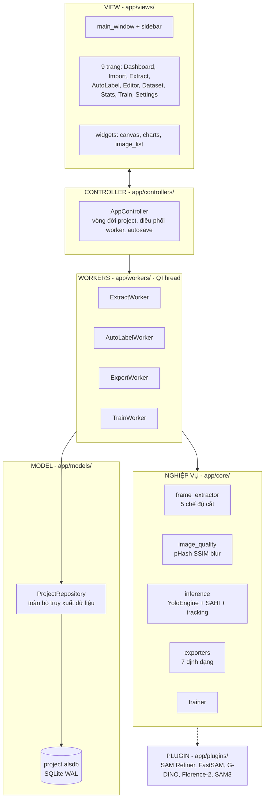
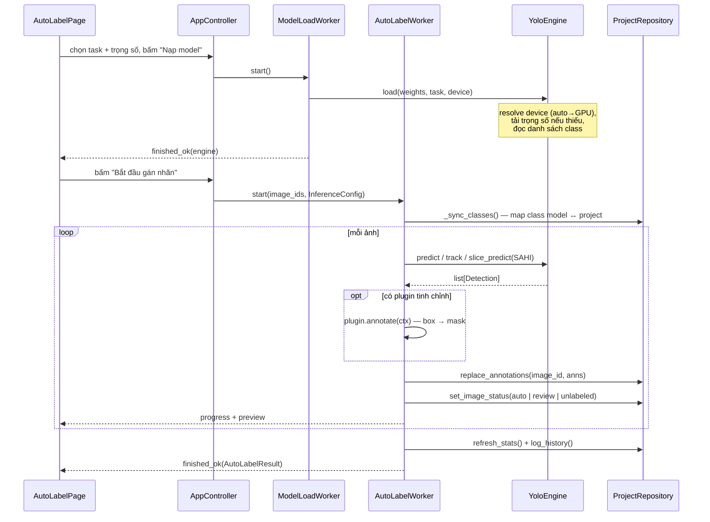

# Tài liệu hệ thống — AutoLabel Studio AI

> Phiên bản 1.0 · Cập nhật 2026-08 · Dành cho lập trình viên tham gia phát triển và người vận hành muốn hiểu hệ thống.

## 1. Tổng quan

AutoLabel Studio AI là ứng dụng desktop (Python + PySide6) tự động tạo dataset Computer Vision từ video/ảnh: cắt frame → gán nhãn tự động bằng YOLO → sửa nhãn bằng editor → xuất dataset → train lại model ngay trong app.

**Nguyên tắc kiến trúc cốt lõi:**

1. **MVC + Worker**: giao diện (`views/`) không chứa nghiệp vụ; nghiệp vụ (`core/`) không biết gì về Qt widget; mọi tác vụ nặng chạy trong `QThread` worker riêng.
2. **Một project = một thư mục** chứa SQLite (`project.alsdb`, chế độ WAL an toàn đa luồng) và các thư mục con `frames/ images/ exports/ runs/ backups/`.
3. **Model AI nạp một lần, dùng chung**: `YoloEngine` là singleton (`shared_engine()`), tránh nạp lại trọng số mỗi lần suy luận.

## 2. Sơ đồ kiến trúc



**Luật giao tiếp:** View phát tín hiệu → Controller dựng Worker → Worker gọi Core/Repository → kết quả trả về View qua Qt Signal (`progress`, `message`, `stage`, `finished_ok`, `failed`). Không thành phần nào gọi ngược chiều.

## 3. Luồng nghiệp vụ Auto Label (chi tiết)

Đây là luồng trung tâm của sản phẩm, đã được kiểm chứng end-to-end với trọng số thật (xem `docs/TAI-LIEU-KIEM-THU.md`).



### 3.1. Quy tắc nghiệp vụ quan trọng

| Quy tắc | Chi tiết | Nơi cài đặt |
| --- | --- | --- |
| Ngưỡng review | Detection có `confidence < review_threshold` (mặc định 0.6) → annotation mang status `review`, ảnh chuyển `Cần xem lại` | `AutoLabelWorker._to_annotations` |
| Ngưỡng low-conf | `confidence < low_conf_threshold` (mặc định 0.35) được đếm riêng để cảnh báo | như trên |
| Class lazy | Chỉ tạo class trong project khi **thực sự có** dự đoán thuộc class đó — nạp model COCO không sinh 80 class rỗng | `_sync_classes` + `_to_annotations` |
| Overwrite | `overwrite=False` bỏ qua ảnh đã có nhãn (không gọi model — tiết kiệm GPU) | `execute()` |
| Re-run rỗng | Chạy lại mà model không phát hiện gì → nhãn cũ bị xóa **và status trả về `unlabeled`** (không kê khai sai "máy đã gán nhãn") | `execute()` — sửa BUG-03 |
| Tracking | Chỉ có nghĩa với ảnh có `frame_index`; ảnh được sắp theo frame trước khi chạy; `track_id` lưu vào annotation | `execute()` + `YoloEngine.track` |
| Tách tracker | Sau phiên tracking, mọi `predict()` thường phải **gỡ callback tracker** trước khi chạy — nếu không BoT-SORT tiếp tục chạy ngầm, nuốt detection và gắn track_id giả | `YoloEngine._detach_tracker` — sửa BUG-01 |
| SAHI | Ảnh lớn cắt thành ô chồng lấn → inference từng ô → dịch tọa độ → NMS xuyên ô → (segmentation) gộp polygon ranh giới bằng Shapely | `YoloEngine.slice_predict` |
| Min area | Detection có diện tích < `min_area_px` (mặc định 24px²) bị loại | `YoloEngine._parse` |

### 3.2. Trạng thái ảnh và annotation

```text
Ảnh:        unlabeled ──auto label──▶ auto ──có nhãn dưới ngưỡng──▶ review ──người duyệt──▶ approved
Annotation: auto | review | approved   (đổi qua Editor hoặc duyệt hàng loạt)
```

## 4. Lược đồ dữ liệu chính (SQLite)

| Bảng | Vai trò | Cột đáng chú ý |
| --- | --- | --- |
| `project` | 1 dòng metadata | `task` (detect/segment/obb/pose), `meta` JSON |
| `class` | danh sách class | `name`, `color`, `order_index` |
| `image` | mỗi ảnh trong project | `path`, `frame_index`, `phash`, `blur_score`, `status`, `is_duplicate`, `n_objects` |
| `annotation` | mỗi đối tượng | `bbox` (JSON), `polygon` (JSON), `keypoints`, `confidence`, `status`, `source`, `track_id` |
| `history` | nhật ký thao tác | hiển thị ở Dashboard |

Mọi truy cập DB đi qua `ProjectRepository` — **không viết SQL ở nơi khác**. Database bật WAL nên worker thread ghi song song với UI đọc an toàn.

## 5. Hệ thống plugin

- Giao ước: kế thừa `AnnotatorPlugin` (`app/plugins/base.py`), khai báo `PluginInfo(key, name, kind, requires)`, cài `annotate(ctx) -> list[Detection]`.
- `kind="refine"`: nhận detection từ YOLO, trả bản tinh chỉnh (vd box → mask SAM). `kind="generate"`: tự sinh detection từ prompt.
- Registry tự khám phá plugin builtin + thư mục `%LOCALAPPDATA%\AutoLabelStudioAI\plugins\`.
- Plugin khai báo tham số qua `default_config()`; người dùng chỉnh trong **Settings → Plugin** (lưu tại `plugins.config.<key>` trong settings.json).
- Plugin lỗi **không được** làm sập worker: `_apply_plugin` bọc try/except và trả detection gốc.

## 6. Đường dẫn hệ thống

| Đường dẫn | Nội dung |
| --- | --- |
| `%LOCALAPPDATA%\AutoLabelStudioAI\settings.json` | cấu hình ứng dụng (dot-path) |
| `%LOCALAPPDATA%\AutoLabelStudioAI\logs\` | log xoay vòng theo ngày |
| `%LOCALAPPDATA%\AutoLabelStudioAI\weights\` | trọng số tải tự động (yolo11n.pt, sam_b.pt...) — chỉ thư mục này được phép dọn tự động khi file hỏng (BUG-02) |
| `%LOCALAPPDATA%\AutoLabelStudioAI\plugins\` | plugin của người dùng |
| `<project>\project.alsdb` (+`-wal`, `-shm`) | dữ liệu project |
| `<project>\backups\` | sao lưu xoay vòng (autosave, giữ 10 bản) |

## 7. Quy ước phát triển

- Python ≥ 3.10, lint/format bằng `ruff` (cấu hình trong `pyproject.toml`), hook `pre-commit`.
- Test bằng `pytest` (`tests/`), chạy offscreen không cần GPU; test E2E model thật gate sau biến môi trường `ALS_E2E=1`.
- Chuỗi hiển thị bọc `tr("key", "fallback")` (`app/i18n`) — không hard-code tiếng Việt trong code mới.
- Xem thêm `CONTRIBUTING.md` để biết quy trình PR và quy tắc worker.
